# Frontend Mentor - Space tourism website solution

This is a solution to the [Space tourism website challenge on Frontend Mentor](https://www.frontendmentor.io/challenges/space-tourism-multipage-website-gRWj1URZ3). Frontend Mentor challenges help you improve your coding skills by building realistic projects.

## Table of contents

-   [Overview](#overview)
    -   [Screenshot](#screenshot)
    -   [Links](#links)
-   [My process](#my-process)
    -   [Built with](#built-with)
    -   [Useful resources](#useful-resources)
-   [Author](#author)

## Overview

### Screenshot

You can watch all of the pages preview on different devices:-

#### Desktop Preview:-

-   ##### Home page:

    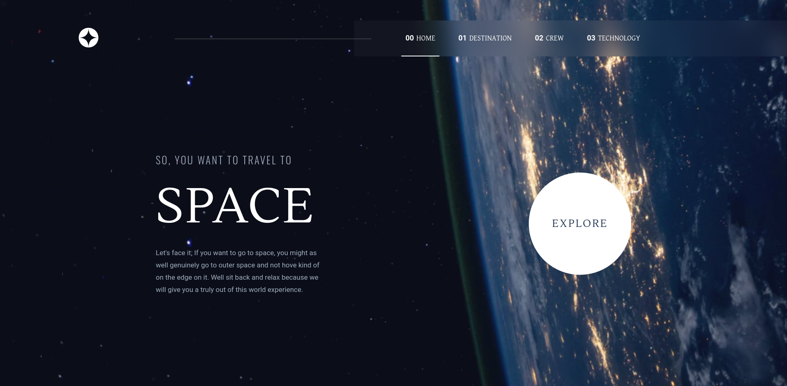

-   ##### Destination page:

    

-   ##### Crew page:

    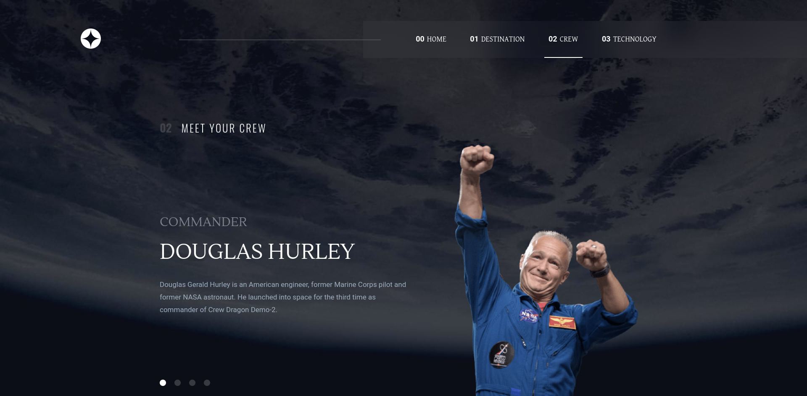

-   ##### Technology page:
    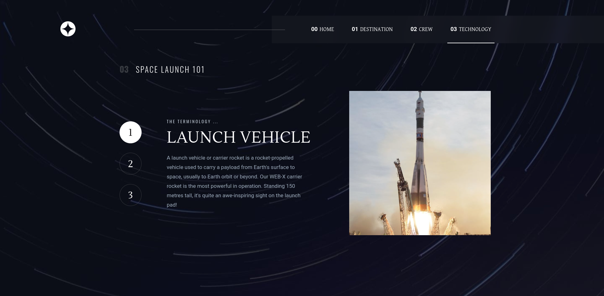

#### Tablet Preview:-

-   ##### Home page:

    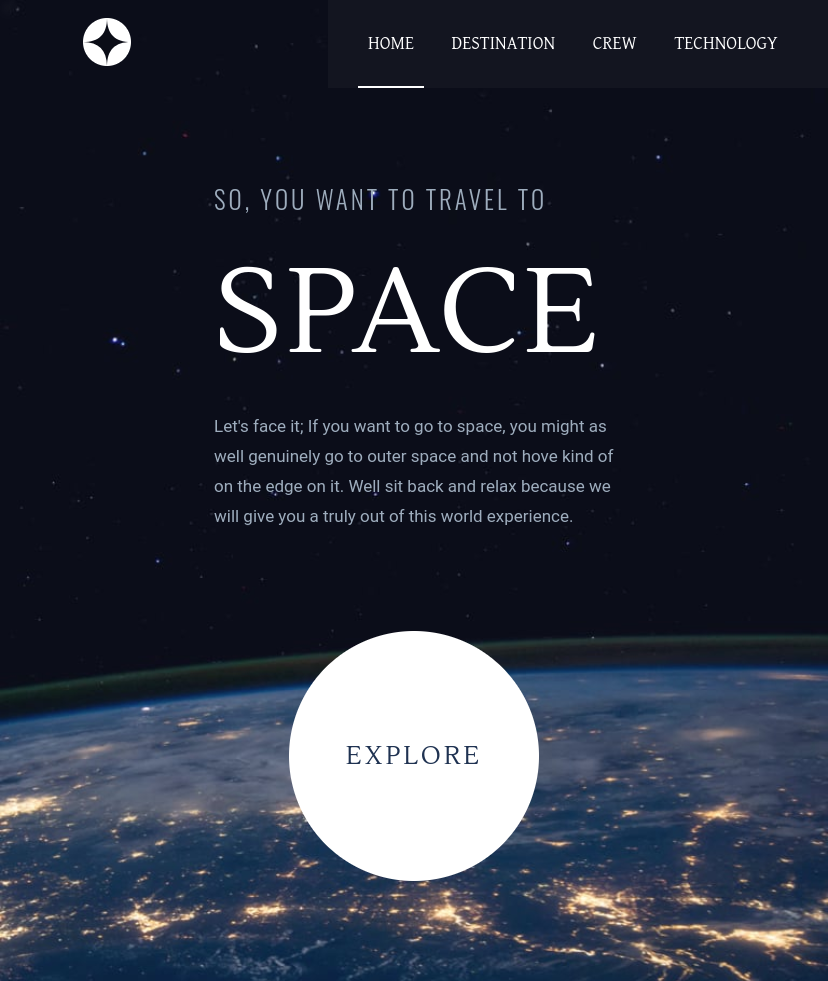

-   ##### Destination page:

    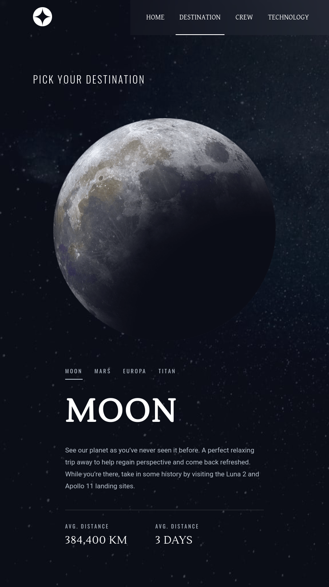

-   ##### Crew page:

    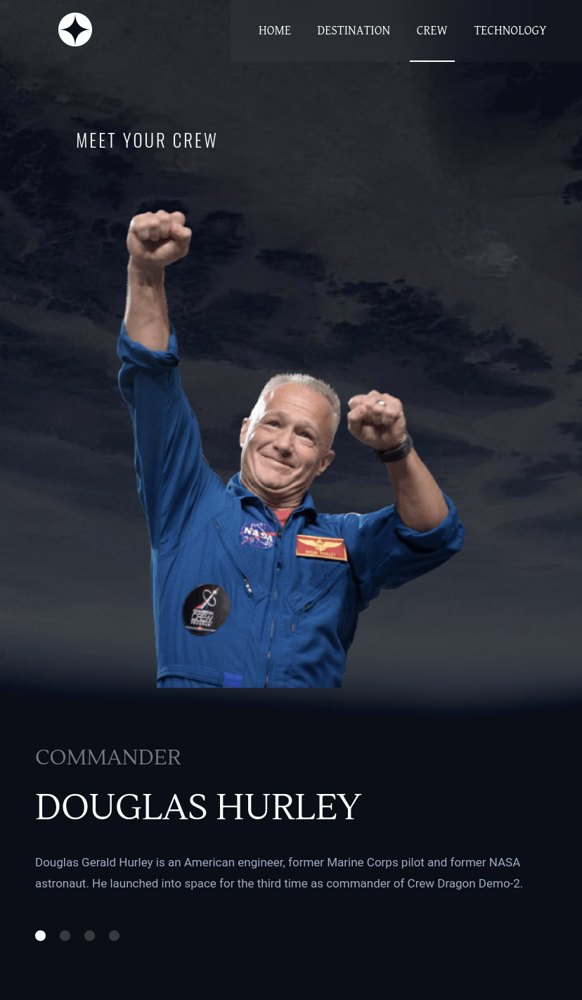

-   ##### Technology page:
    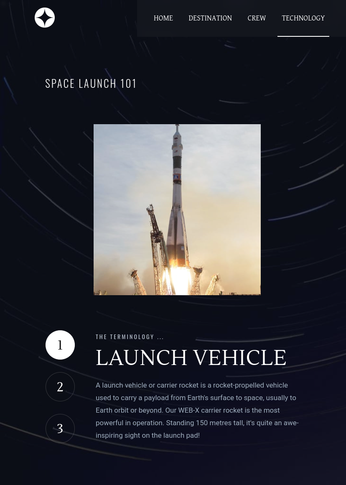

#### Mobile Preview:-

-   ##### Home page:

    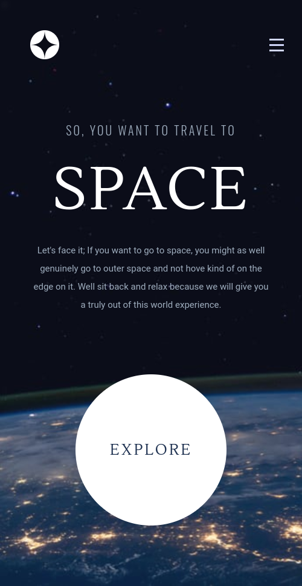

-   ##### Destination page:

    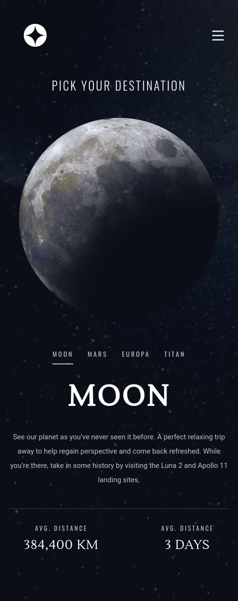

-   ##### Crew page:

    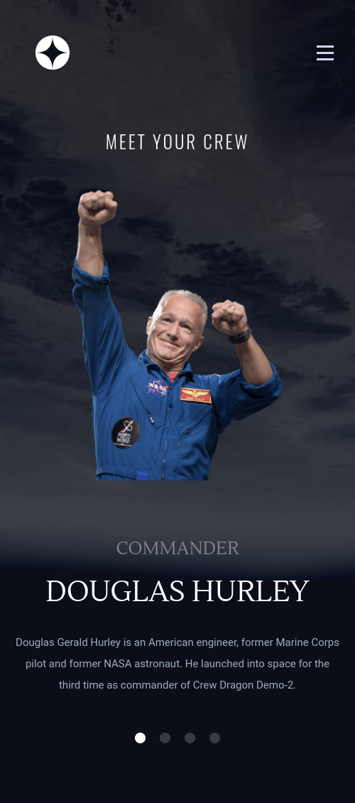

-   ##### Technology page:
    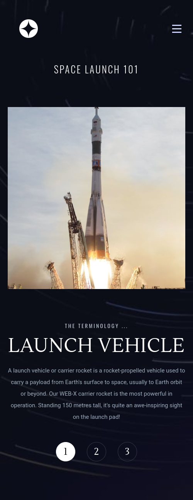

### Links

-   Solution URL: [https://github.com/ashrafulhossen/space-tourism](https://github.com/ashrafulhossen/space-tourism)
-   Live Site URL: [https://space-tourism-seven-neon.vercel.app/](https://space-tourism-seven-neon.vercel.app/)

## My process

### Built with

-   [React](https://reactjs.org/) - JS library
-   [Sass](https://sass-lang.com/)

### Useful resources

-   [Frontend Mentor](https://www.frontendmentor.io) - Try Frontend Mentor to build your frontend design knowledge and experience.

## Author

-   Portfolio - [ashrafulhossen-protfolio](https://ashrafulhossen-portfolio.netlify.app/)
-   Frontend Mentor - [@ashrafulhossen](https://www.frontendmentor.io/profile/ashrafulhossen)
-   Github - [@ashrafulhossen](https://github.com/ashrafulhossen)
